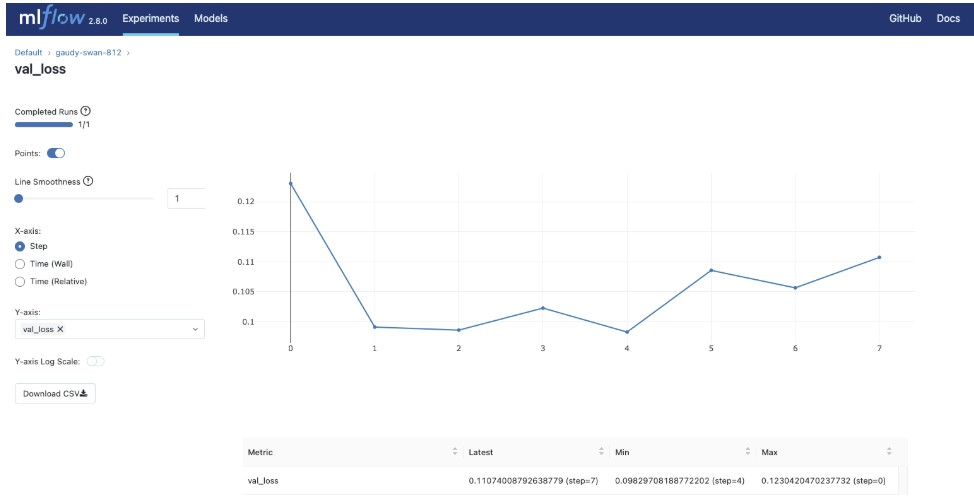

# Scorimo - Listing Quality Scoring Tool

## Context

Finding student housing in France is already stressful, and a lot of listings on SeLoger or Leboncoin make it worse. Photos are missing or useless, descriptions are vague, and some prices are clearly off. You waste time opening listings that have nothing to tell you.

Scorimo scores each listing from 0 to 100 and flags exactly what's wrong, so students can decide at a glance whether something's worth clicking into.

We kept the project simple on purpose. We're more comfortable with data and rule logic than with building full-stack systems, and we didn't want to over-engineer something that's essentially a scoring tool. It works, it's easy to explain, and that's enough for now.

---

## Data Source

The data used in this project is randomly generated within reasonable French market ranges for demonstration purposes. A real deployment would require integrating actual listing data from platforms such as SeLoger or Leboncoin, including fields like photo count and description length.

### Input fields

The API accepts the following listing attributes:

- `price` - Price in euros
- `surface` - Surface area in m^2
- `description_length` - Number of characters in the listing description
- `photo_count` - Number of photos attached to the listing
- `location_precision` - Granularity of the stated location ("address", "arrondissment", or "city")
- `rooms` - number of rooms

---

## What the Tool Returns

Calling `POST /predict` with a listing's fields returns:

- `quality_score` - an integer from 0 to 100
- `tier` - HIGH (score >= 75), MEDIUM (score >= 50), or LOW (score < 50)
- `issues` - a list of the specific problems detected
- `model_version` - the version of the scoring logic used

Example response:

```json
{
  "quality_score": 58,
  "tier": "MEDIUM",
  "issues": ["Too few photos", "Short description"],
  "model_version": "v1.4"
}
```

---

## Scoring Method

The score starts at 100. Points are deducted when a listing fails a threshold:

| Problem | Condition | Points lost |
|---|---|---|
| Too few photos | photo_count < 3 | -20 |
| Short description | description_length < 100 | -15 |
| Price per m^2 too high | price / surface > 15,000 | -10 |
| No room information | rooms is missing | -10 |
| Imprecise location | location_precision = "city" | -10 |

The final score is grouped into a tier: HIGH means the listing looks complete and is worth a closer look; MEDIUM means some information is missing or unclear; LOW means too many fields are absent or suspicious.

### Why rules rather than a trained model

We looked for existing datasets that include things like photo count and description length, but there aren't any public ones that also come with quality labels.

Without labelled data, training a model didn't make sense. Rules felt like the right call here: every deduction ties back to a specific field and threshold, so the score is easy to explain and easy to tweak if the thresholds turn out to be off.

We do train a model in train.py, but only to sanity-check the rules, with an MAE of 5.26 tells us the scoring logic is at least consistent.

---

## MLOps Pipeline

### Data layer

Sample data is randomly generated within reasonable French real estate market ranges in data/prepare_data.py and stored in data/processed/. The scoring thresholds are defined separately in training/score_rules.py so they can be updated without touching the rest of the codebase.

### Experiment tracking with MLflow

Each training run logs its parameters, metrics, and model artifact to MLflow. To open the dashboard:

```bash
mlflow ui
# opens at http://localhost:5000
```

*Illustrative screenshot of MLflow experiment tracking. Each training run logs parameters (n_estimators, max_depth) and metrics (MAE). In our runs, the model achieved an MAE of 5.26, confirming the scoring rules are consistent. Note: model promotion to Production is done manually via the MLflow UI under the Models tab.*

### Model registry

Models are promoted through three stages: None, Staging, and Production. The serving API always loads whichever model is marked Production. Switching versions requires only a registry update and a container restart, without any code changes.

### Serving with FastAPI and Docker

Three endpoints are available:

- `POST /predict` - score a listing
- `GET /health` - confirm the API is running
- `GET /model-info` - see which model version is loaded

### Monitoring with Evidently

Predictions are saved and compared against the training data distribution. To run a drift report:

```bash
python monitoring/monitor.py
# generates drift_report.html
```

*Illustrative screenshot of an Evidently data drift report. Scorimo uses DataDriftPreset to compare incoming prediction data against the training baseline. The report flags which features have shifted and by how much. Note: in this proof-of-concept, drift detection is run manually rather than on a schedule.*
---

## Limitations and Possible Improvements

This is a proof-of-concept, and we know it. The thresholds we use, fewer than 3 photos, descriptions under 100 characters, etc. are educated guesses, not numbers derived from real data.

The problem is real though, and the approach can be improved. The obvious next step is scraping actual listings from SeLoger or Leboncoin and using the real distributions to set better thresholds.
---

## Project Structure

```
data/prepare_data.py       - downloads and cleans the source data
data/raw/                  - original files from data.gouv.fr
data/processed/            - cleaned dataset used for training
training/train.py          - trains the model and logs results to MLflow
training/score_rules.py    - defines the deduction rules
training/evaluate.py       - evaluates model performance
serving/app.py             - FastAPI application
serving/model_loader.py    - loads the Production model from the registry
serving/Dockerfile         - container definition
monitoring/monitor.py      - runs drift detection
monitoring/reference_data.csv - baseline data for comparison
docker-compose.yml         - orchestrates all services
requirements.txt           - Python dependencies
```

---

## Installation and Usage

### Requirements

- Python 3.10 or higher
- Docker

### Running locally

```bash
git clone https://github.com/audreyli0428/Scorimo.git
cd Scorimo
pip install -r requirements.txt
python data/prepare_data.py
python training/train.py
# Open http://localhost:5000, promote the model to Production in the MLflow UI
docker-compose up
```

### Calling the API

```bash
curl -X POST http://localhost:8000/predict \
  -H "Content-Type: application/json" \
  -d '{"price": 320000, "surface": 45, "photo_count": 2, "description_length": 80, "rooms": 2}'
```

### Running with Docker only

```bash
docker build -t scorimo .
docker run --rm -p 8000:8000 scorimo
```

---

## Team

| Member | Role | Responsible for |
|---|---|---|
| Hangbo Yang | MLOps Engineer | MLflow tracking, model registry (`training/`) |
| Ke Chen | Deployment Engineer | FastAPI, Docker, model loader (`serving/`) |
| Haoju Li | Data and Monitoring | Data pipeline, scoring rules, Evidently (`data/`, `monitoring/`) |
